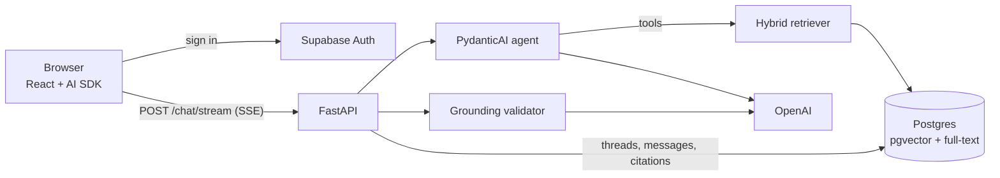

# Stock Research Copilot

An AI research assistant for SEC filings. Ask a question about a company's 10-K filings and get an answer where **every claim is cited** to the exact passage it came from, with one click to read the source in context.

**Live demo:** [stock-research-copilot.vercel.app](https://stock-research-copilot.vercel.app)

> Answers are generated only from the filings in the corpus. The assistant does not give investment advice or stock recommendations, and it says so when the filings don't contain enough evidence.

---

## Features

- **Grounded answers.** The assistant answers only from retrieved filing passages and marks every claim with an inline citation like `[1]`.
- **Fail-closed citation checks.** Each answer is validated before it reaches you: citations must point to passages actually retrieved in that turn, and an LLM judge verifies that each cited passage supports its claim. Answers that fail are retried once, then rejected rather than shown unverified.
- **Source viewer.** Click any citation to open the original passage with the chunks before and after it, plus the full normalized table when the citation comes from a financial table.
- **Hybrid search.** Combines pgvector semantic search with Postgres full-text search, merged with Reciprocal Rank Fusion.
- **Live progress.** While the agent works, the UI streams its stages ("Searching SEC filings…", "Reading source passages…", "Verifying citations…").
- **Persistent conversations.** Threads and messages, including citations, are stored per user and protected by Postgres row-level security.

## Corpus

The included pipeline downloads and indexes **10-K filings for AAPL, MSFT, NVDA, AMZN and GOOGL, fiscal years 2021–2025** (25 filings). Tickers and filing counts are configurable in `data/download.py`.

---

## How it works



One chat turn:

1. The frontend sends the conversation to `POST /chat/stream` with the user's Supabase token.
2. The backend verifies the token and checks that the user owns the thread.
3. A PydanticAI agent answers the question using four tools: `search_filings`, `read_chunks`, `read_chunk` and `read_surrounding_chunks`. Every passage the tools return is recorded in a per-turn registry, which becomes the allowlist of citable sources.
4. The grounding validator checks the structured answer: citation numbering, markers matching citations, every citation pointing to a retrieved chunk, and an LLM judge confirming support. On failure the agent retries once.
5. The verified answer streams to the browser as AI SDK-compatible server-sent events, then the turn and its citations are saved.

---

## Tech stack

| Layer             | Technology                                                                                                                       |
| ----------------- | -------------------------------------------------------------------------------------------------------------------------------- |
| Frontend          | React 19, TypeScript, Vite, Tailwind CSS 4, shadcn/ui, Vercel AI SDK, React Router                                               |
| Backend           | Python 3.13, FastAPI, PydanticAI, SQLAlchemy 2, Alembic                                                                          |
| Database and auth | Supabase (Postgres with pgvector, Auth, row-level security)                                                                      |
| Models            | OpenAI: `text-embedding-3-small` for embeddings, GPT-4.1 for the agent, GPT-4.1 mini for keyword extraction and grounding checks |
| Ingestion         | Docling (HTML to Markdown), custom SEC table extraction, token-based chunking                                                    |
| Tooling           | uv, pnpm, pytest, Ruff, ESLint                                                                                                   |
| Hosting           | Vercel (frontend and backend), Supabase                                                                                          |

---

## Repository structure

```
stock-research-copilot/
├── backend/
│   ├── app/
│   │   ├── api/          # FastAPI routes (auth, chat)
│   │   ├── assistant/    # PydanticAI agent, tools, system prompt
│   │   ├── auth/         # Supabase JWT verification
│   │   ├── chat/         # Turn orchestration, SSE streaming, message conversion
│   │   ├── database/     # SQLAlchemy models, sessions, Supabase clients, queries
│   │   ├── grounding/    # Citation validator and LLM judge
│   │   ├── retrieval/    # Embeddings, semantic + full-text search, RRF fusion
│   │   ├── schemas/      # Request and response models
│   │   ├── config.py     # Settings loaded from environment
│   │   └── main.py       # FastAPI app
│   ├── alembic/          # Database migrations (schema, indexes, RLS policies)
│   ├── ingest/           # Loading, chunking and embedding filings
│   ├── scripts/          # Smoke tests for retrieval and the agent
│   └── tests/
├── data/
│   ├── download.py             # Download 10-K filings from SEC EDGAR
│   └── convert_to_markdown.py  # Convert filings to Markdown and extract tables
└── frontend/
    └── src/
        ├── components/   # Chat UI, citations, source viewer, shadcn/ui
        ├── hooks/        # Chat transport, threads, session
        ├── lib/          # API client, Supabase client, citation helpers
        └── pages/        # Login, sign-up, chat pages
```

---

## Getting started

### Prerequisites

- Python 3.12+ and [uv](https://docs.astral.sh/uv/)
- Node.js 20+ and [pnpm](https://pnpm.io/)
- A [Supabase](https://supabase.com/) project
- An [OpenAI API key](https://platform.openai.com/api-keys) with billing enabled

### 1. Clone the repository

```bash
git clone https://github.com/Eesha-Shahid/stock-research-copilot.git
cd stock-research-copilot
```

### 2. Configure the backend

```bash
cd backend
cp .env.example .env
uv sync
```

Fill in `backend/.env` (see [Environment variables](#environment-variables)). For local development, use the **direct** database connection string from Supabase (**Connect → Direct connection**). If your network doesn't support IPv6, use the **Session pooler** string instead.

### 3. Create the database schema

```bash
uv run alembic upgrade head
```

This enables pgvector and creates all tables, the HNSW and GIN indexes, and the row-level security policies.

### 4. Build the corpus

Run these from the repository root unless noted. The SEC requires a descriptive User-Agent with a contact email, so set `USER_AGENT` in `data/download.py` first.

```bash
# Download filings from SEC EDGAR into data/downloads/
uv run data/download.py

# Convert them to Markdown and extract tables into data/markdown/
uv run data/convert_to_markdown.py
```

Then load and index them, from `backend`:

```bash
cd backend

# Create a source_documents row per filing
uv run python -m ingest.load_source_documents

# Chunk, embed and store every filing (calls the OpenAI embeddings API)
uv run python -m ingest.chunk_and_embed --all
```

Ingestion is idempotent: documents that already have chunks are skipped. Useful flags for `chunk_and_embed`:

| Flag                   | Purpose                                           |
| ---------------------- | ------------------------------------------------- |
| `--accession <number>` | Process a single filing instead of `--all`        |
| `--dry-run`            | Chunk only, with no embeddings or database writes |
| `--max-chunks 1`       | Cap chunks per document, for a quick smoke test   |
| `--force`              | Delete and rebuild chunks for the target filings  |

To check the result, run in the Supabase SQL Editor:

```sql
select count(*) as chunks, count(embedding) as embedded from document_chunks;
```

### 5. Run the backend

```bash
cd backend
uv run uvicorn app.main:app --reload
```

The API runs at `http://localhost:8000`, with interactive docs at `http://localhost:8000/docs`.

### 6. Run the frontend

In a second terminal:

```bash
cd frontend
cp .env.example .env
pnpm install
pnpm dev
```

Fill in `frontend/.env`, then open `http://localhost:5173`.

---

## Environment variables

### Backend (`backend/.env`)

| Variable                      | Required | Description                                                                                 |
| ----------------------------- | -------- | ------------------------------------------------------------------------------------------- |
| `SUPABASE_URL`                | Yes      | Project URL, from **Project Settings → API**                                                |
| `SUPABASE_ANON_KEY`           | Yes      | Public anon key                                                                             |
| `SUPABASE_SERVICE_ROLE_KEY`   | Yes      | Service role key; backend only, never expose it                                             |
| `DATABASE_URL`                | Yes      | Postgres connection string: direct locally, transaction pooler in production                |
| `OPENAI_API_KEY`              | Yes      | Used for embeddings, the agent, keyword extraction and grounding                            |
| `OPENAI_CHAT_MODEL`           | No       | Agent model, e.g. `gpt-4.1`                                                                 |
| `OPENAI_GROUNDING_MODEL`      | No       | Grounding judge model (default `gpt-4.1-mini`)                                              |
| `OPENAI_EMBEDDING_MODEL`      | No       | Default `text-embedding-3-small`; must match the model used at ingestion                    |
| `OPENAI_EMBEDDING_DIMENSIONS` | No       | Default `1536`; must match the database column                                              |
| `OPENAI_AGENT_REQUEST_LIMIT`  | No       | Maximum model requests per agent run (default `20`)                                         |
| `RETRIEVAL_*`                 | No       | Search tuning: candidate and top-k sizes, RRF constant, neighbor radius, keyword extraction |
| `ALLOWED_ORIGINS`             | Yes      | Comma-separated frontend origins for CORS, e.g. `http://localhost:5173`                     |

See `backend/.env.example` for every option with its default.

### Frontend (`frontend/.env`)

| Variable                 | Description                                                   |
| ------------------------ | ------------------------------------------------------------- |
| `VITE_API_BASE_URL`      | Backend URL, e.g. `http://localhost:8000` (no trailing slash) |
| `VITE_SUPABASE_URL`      | Same as `SUPABASE_URL`                                        |
| `VITE_SUPABASE_ANON_KEY` | Same as `SUPABASE_ANON_KEY`                                   |

Only public values belong in the frontend: `VITE_` variables are embedded in the browser bundle.

---

## API

| Method   | Path                                 | Description                              |
| -------- | ------------------------------------ | ---------------------------------------- |
| `GET`    | `/health`                            | Health check                             |
| `GET`    | `/me`                                | The authenticated user                   |
| `GET`    | `/chat/threads`                      | List the user's conversations            |
| `POST`   | `/chat/threads`                      | Create a conversation                    |
| `DELETE` | `/chat/threads/{thread_id}`          | Delete a conversation                    |
| `GET`    | `/chat/threads/{thread_id}/messages` | Message history, with citations          |
| `POST`   | `/chat/stream`                       | Run one turn and stream the answer (SSE) |
| `GET`    | `/chat/citations/{chunk_id}/context` | A cited passage with neighboring chunks  |

All routes except `/health` require `Authorization: Bearer <supabase access token>`.

---

## Testing

```bash
cd backend

# Unit tests (no network or database needed)
uv run pytest -m "not integration"

# Everything, including integration tests against your database and OpenAI
uv run pytest

# End-to-end smoke tests
uv run python scripts/smoke_retrieval.py
uv run python scripts/smoke_assistant.py
```

Frontend type-check and build:

```bash
cd frontend
pnpm build
```

---

## Deployment

The app is deployed as two Vercel projects from this repository, with Supabase as the database:

| Project  | Root directory | Notes                                                                                                    |
| -------- | -------------- | -------------------------------------------------------------------------------------------------------- |
| Backend  | `backend`      | Detected as FastAPI and run as a Python function. Entrypoint set by `[tool.vercel]` in `pyproject.toml`. |
| Frontend | `frontend`     | Detected as Vite. `frontend/vercel.json` rewrites routes to `index.html` for client-side routing.        |

Production notes:

- Use Supabase's **transaction pooler** URL (port `6543`) for `DATABASE_URL` on Vercel. The direct connection is IPv6-only. The backend uses `NullPool` and disables prepared statements to work with it.
- Set `ALLOWED_ORIGINS` on the backend to the frontend's URL, and `VITE_API_BASE_URL` on the frontend to the backend's URL. Redeploy after changing environment variables.
- In Supabase **Authentication → URL Configuration**, set the Site URL and redirect URLs to the frontend's URL.
- Run migrations and ingestion from your machine, not from Vercel.

---

## Limitations

- The corpus covers five companies' 10-K filings; questions outside it get an "insufficient evidence" response.
- Answers are generated in full and validated before streaming, so the first words appear only after the agent finishes, typically within several seconds to a minute.
- Full-text search requires all extracted keywords to match, so unusually phrased questions rely more on semantic search.
- This is a research tool, not financial advice.
